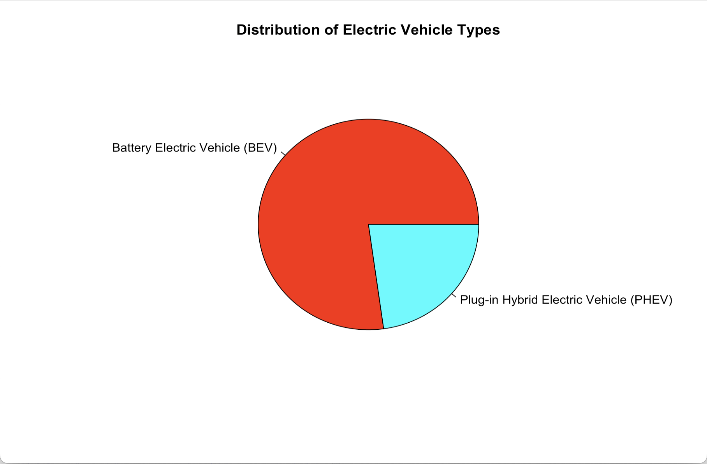
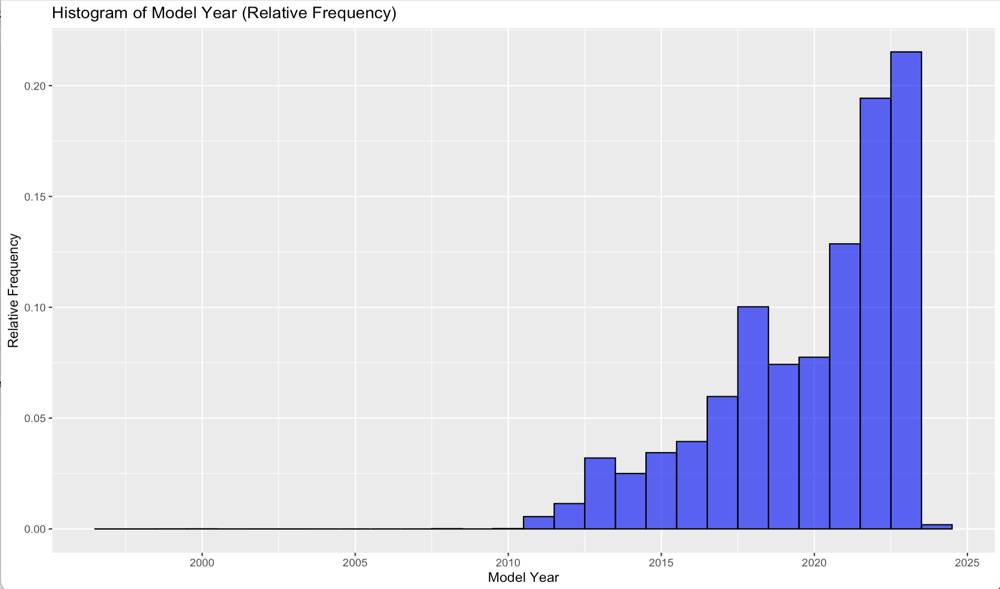
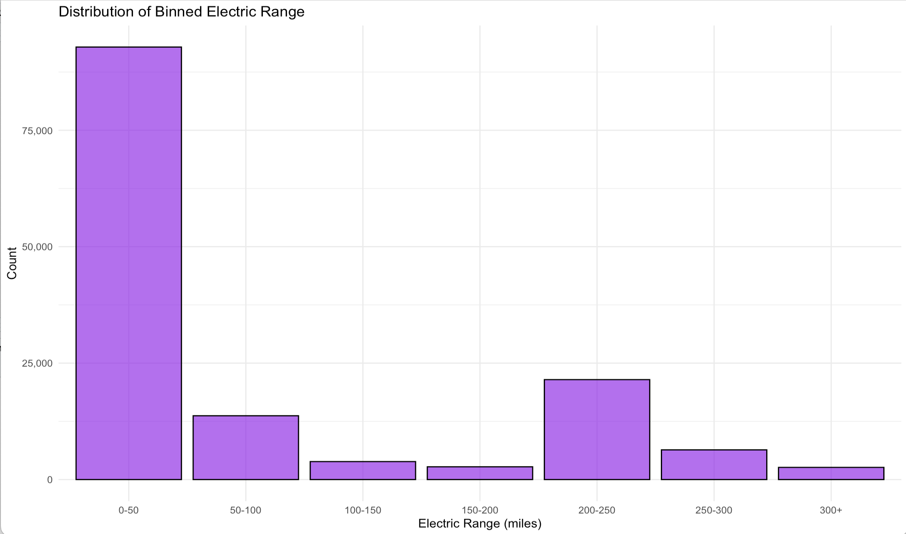
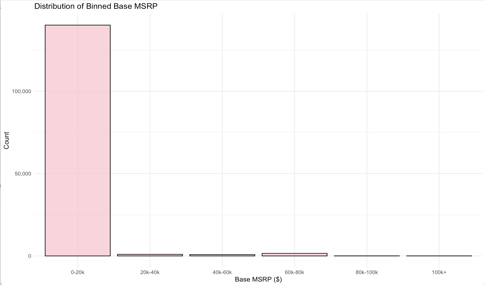
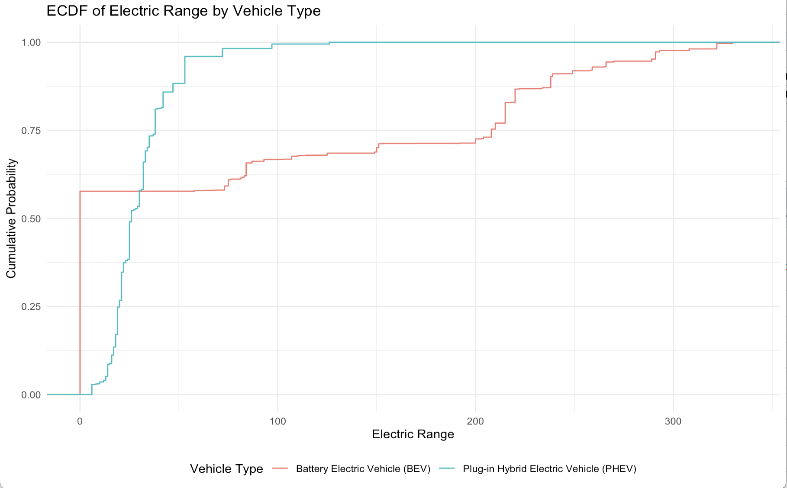
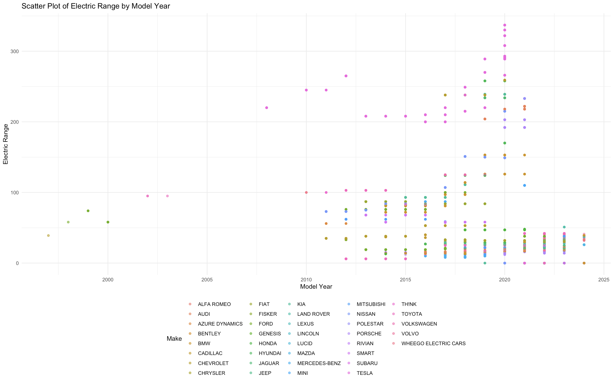

# 🏎 Electric Vehicle Analysis: Dive Deep 🚀

Dive deep into the electrifying world of EVs. Explore the market, witness trends, and understand the intricacies of vehicle types, ranges, and year-wise evolutions.

---

## 📊 **1. Market Overview**

Venture into the heart of the EV market. Discover where most vehicles lie in terms of range and price. Understand the choices that manufacturers are making.

> 
>
> *Distribution of Electric Vehicle Types*

> 
>
> *Market Share of EV Brands*

---

## 🕝 **2. Time Machine: The EV Evolution**

Journey through time with histograms that unravel the story of EVs, from their humble beginnings to their recent surge.

### **Histogram Highlights**:

> 
>
> *Model Year: A Standard Frequency Perspective*

> 
>
> *Model Year: A Dive into Relative Frequencies*

> 
>
> *Electric Range vs. Count*

> 
>
> *Base MSRP ($) vs. Count*

---

## 📈 **3. ECDF: The Electric Range Spectrum**

The ECDF plot is a window into the electric range distribution. Decode the nuances and understand where most vehicles stand.

> 
>
> *ECDF of Electric Range by Vehicle Type*

---

## 🌐 **4. Insights by Segmentation**

Dive into segmented visualizations that offer a kaleidoscope view into electric ranges, vehicle types, and more.

> 
>
> *Scatter Plot: Exploring Variable Relationships*

---

💡 **Note**: Deep insights await as you explore each visualization. They offer a snapshot of the dynamic landscape of the electric vehicle industry.

---

